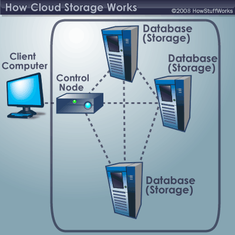
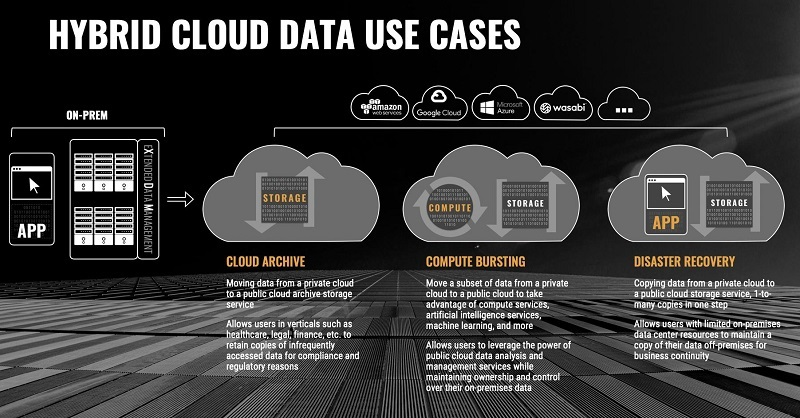
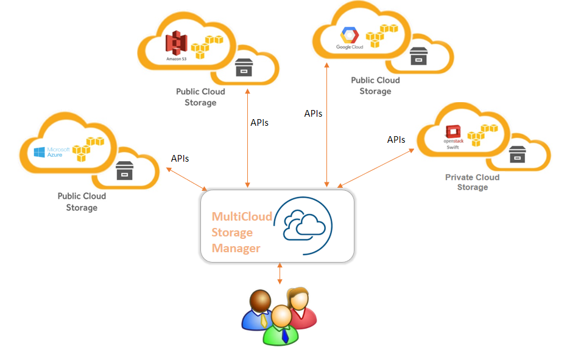
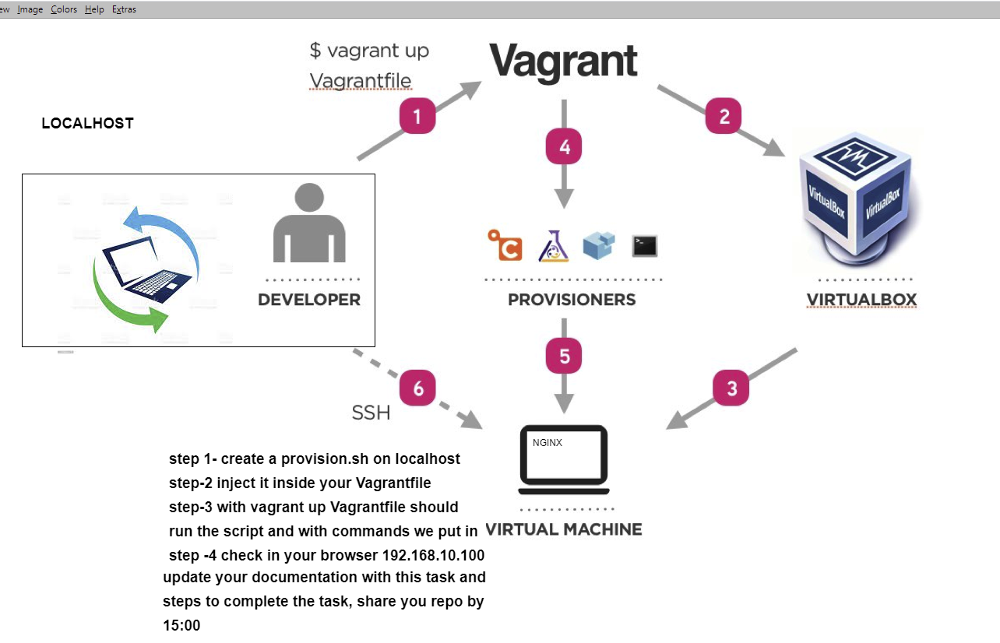

# SRE introduction
## Cloud Computing with AWS
### SDLC stages
#### Risk factors with SDLC stages
##### Monitoring

### Key Advantages:
- Flexibility
- Robustness
- Ease of use
- Cost


**SRE introduction**
- What is the role of SRE?
	- SREs are responsible for the reliability of a service
	- They ensure that a service is tested in all potential scenarios, and that risks and errors are identified early (ideally before the customer notices) and resolved quickly and smoothly
	- They help to make a business's service more flexible, more robust, easier to use, and more cost-effective


**Cloud Computing**
- What is Cloud Computing and the benefits of using it?
	- Cloud Computing is the renting of a cloud computing company's servers.
	- Benefits:
		- It's cheaper for companies to only pay for the servers they use than to buy their own
		- The company can monitor their service live
		- The company can stress-test a service to make sure it can handle extreme cases, e.g. more users than expected


**What is Amazon Web Services (AWS)**
- What is AWS and benefits of using it
	- AWS is a provider of on-demand cloud platforms
	- Benefits:
		- Pay-as-you-go
		- Easy to scale up/down based on your needs - auto-scale
		- AWS take care of the care required to keep a physical server running efficiently


**What is SDLC and stages of SDLC**
- What is SDLC and what are the stages of it?
	- The Software Development Life Cycle is the series of steps that are involved in developing working, robust software
	- Stages:
		- Planning
		- Design
		- Building
		- Testing
		- Deploying
		- Maintaining


**What are the Risk levels at each stage of SDLC?**
- LOW
- MEDIUM
- HIGH
	- Planning: LOW
	- Design: LOW
	- Building: LOW/MEDIUM
	- Testing: LOW/MEDIUM
	- Deploying: HIGH
	- Maintaining: HIGH


**Software Development Cycle**


**On Premises Storage**
- This means that the company has its own physical servers and data centre for their service
- Pros:
        - The company can be fully responsible for the security and upkeep of the servers and data - they are not relying on another business
	-
- Cons:
        - May not be cost-effective, depending on how close the estimation of traffic and storage space required is to how the service is actually used
	- A lot of expenses are required to keep the servers and data centre running, e.g. hiring security guards, buying servers, building physical storage for the servers and data centre, etc.


**Cloud Storage**
- This means that the company rents servers from a cloud computing company instead of buying their own
- Pros:
        - Can scale up or down as the service requires -> flexible
	- Reduces costs as the company is only paying for the servers and space the service requires
- Cons:
        - May not be suitable for sensitive data which needs to be protected in accordance with legislation/company procedure
	- Relying on the cloud computing company to keep the servers running and secure




**Hybrid Cloud Storage**
- This means that the company rents servers for the data they want to be publicly available, but has its own physical servers and data centre for data that needs to be kept private and secure
- Pros:
        - The company can choose which data to make public, and can take on responsibility for protecting more sensitive data so they have better control over who has access to it
- Cons:
        - More expensive than migrating fully to the cloud




**Multi Cloud Storage**
- This means that the company keeps multiple copies of their data and servers with different cloud providers so that the service can still run if one of the providers' service is down
- Pros:
	- Servers and data are backed up
	- Service can continue uninterrupted if one of the servers is down, as the company can switch to another server that is functional
- Cons:
	- More expensive than having one copy as the company needs to pay each extra cloud provider they use, on top of the main one







**To Set Up NginX Web Server On Virtual Machine**
- Make a Vagrantfile with the following text:
Vagrant.configure("2") do |config|
		config.vm.box = "ubuntu/xenial64"
		config.vm.network "private_network", ip: "192.168.10.100"
end
- in git bash, in the same directory as your Vagrantfile, enter the following commands:
	vagrant up
	vagrant ssh
- then use the following:
	sudo apt-get update -y
	sudo apt-get upgrade -y
	sudo apt-get install nginx -y
- to check whether the nginx package installed, use:
	systemctl status nginx
- then, in your browser, type in the ip address from the Vagrantfile (192.168.10.100)


**Tasks**
1. Create provision.sh script (in git bash) with the following lines:
	!#/bin/bash
	sudo apt-get update -y
	sudo apt-get upgrade -y
	sudo apt-get install nginx -y
	- Save and close, then run the following in git bash:
		chmod +x provision.sh
2. Inject the provision.sh script inside the Vagrantfile
	- add the following line in the Vagrantfile before the 'end' line
		config.vm.provision "shell", path: "provision.sh"
3. With vagrant up, Vagrantfile should run the script
4. Check 192.168.10.100 in the browser


**nodejs app**
Add the following to the Vagrantfile before the 'end' line:
	config.vm.synced_folder "app", "/home/ubuntu/app"


**Installing dependencies**
- in the vm in /home/ubuntu, install nodejs with the following line
	sudo apt-get install nodejs -y
- then enter the following lines:
	sudo apt-get install python-software-properties
	curl -sL https://deb.nodesource.com/setup_6.x | sudo -E bash -
	sudo apt-get install nodejs -y

- install pm2 with the following line:
	sudo npm install pm2 -g
- then cd into the app folder, and run:
	sudo npm install
- then run:
	sudo npm start
- in the browser, type in 192.168.10.100:3000


**Reverse Proxy Steps**
- In the vm, enter the following command:
	sudo nano /etc/nginx/sites-available/default
- In the server section, replace the location code with the following:
location / {
        proxy_pass http://localhost:3000;
        proxy_http_version 1.1;
        proxy_set_header Upgrade $http_upgrade;
        proxy_set_header Connection 'upgrade';
        proxy_set_header Host $host;
        proxy_cache_bypass $http_upgrade;
    }
- Save and close
- Then enter the following code to check there were no errors:
	sudo nginx -t
- Then enter the following:
	sudo systemctl restart nginx
- Now enter this last line to start the app, and navigate to the localhost ip:
	sudo npm start


**Automation Notes**
Prerequisites:
- Install VirtualBox, Vagrant, and Ruby.
1. Create a directory for the app to run in
2. Create a Vagrantfile file with the following contents:
```
Vagrant.configure("2") do |config|
    config.vm.define "db" do |db|
      db.vm.box = "ubuntu/xenial64"
      db.vm.network "private_network", ip: "192.168.10.150"
      db.vm.synced_folder "config_files", "/home/ubuntu/config_files"
      db.vm.provision "shell", path: "db_provision.sh"
    end
    config.vm.define "app" do |app|
      app.vm.box = "ubuntu/xenial64"
      app.vm.network "private_network", ip: "192.168.10.100"
      app.vm.synced_folder "app", "/home/ubuntu/app"
      app.vm.synced_folder "config_files", "/home/ubuntu/config_files"
      app.vm.provision "shell", path: "app_provision.sh"
    end
end
```
3. Create a db_provision.sh file with the following contents:
```bash
!#/bin/bash

sudo apt-get update -y
sudo apt-get upgrade -y
wget -qO - https://www.mongodb.org/static/pgp/server-4.4.asc | sudo apt-key add 
echo "deb [ arch=amd64,arm64 ] https://repo.mongodb.org/apt/ubuntu xenial/mongodb-org/4.4 multiverse" | sudo tee /etc/apt/sources.list.d/mongodb-org-4.4.list
sudo apt-get update -y
sudo apt-get install -y mongodb-org
sudo systemctl start mongod
sudo systemctl enable mongod
sudo ufw allow from 192.168.10.100/32 to any port 27017
sudo rm /etc/mongod.conf
sudo ln -s /home/ubuntu/config_files/mongod.conf /etc/mongod.conf
sudo systemctl restart mongod
```
4. Create an app_provision.sh file with the following contents:
```bash
!#/bin/bash

sudo apt-get update -y
sudo apt-get upgrade -y
sudo apt-get install nginx -y
sudo apt-get install nodejs -y
sudo apt-get install python-software-properties -y
curl -sL https://deb.nodesource.com/setup_6.x | sudo -E bash -
sudo apt-get install nodejs -y
cd /home/ubuntu/app
sudo npm install pm2 -g
sudo npm install
sudo rm /etc/nginx/sites-available/default
sudo ln -s /home/ubuntu/config_files/default /etc/nginx/sites-available/default
sudo nginx -t
sudo systemctl restart nginx
echo 'export DB_HOST=192.168.10.150:27017/posts/' >> /etc/environment
source /etc/environment
node seeds/seed.js
npm start
```
5. Create a directory called config_files
6. In config_files, create a default file with the following contents:
```
server {
    listen 80;

    server_name _;

    location / {
        proxy_pass http://localhost:3000;      
        proxy_http_version 1.1;
        proxy_set_header Upgrade $http_upgrade;
        proxy_set_header Connection 'upgrade'; 
        proxy_set_header Host $host;
        proxy_cache_bypass $http_upgrade;      
    }
}
```
7. In config_files, create a file called mongod.conf with the following contents:
```
# mongod.conf

# for documentation of all options, see:
#   http://docs.mongodb.org/manual/reference/configuration-options/

# Where and how to store data.
storage:
  dbPath: /var/lib/mongodb
  journal:
    enabled: true
#  engine:
#  mmapv1:
#  wiredTiger:

# where to write logging data.
systemLog:
  destination: file
  logAppend: true
  path: /var/log/mongodb/mongod.log

# network interfaces
net:
  port: 27017
  bindIp: 0.0.0.0


# how the process runs
processManagement:
  timeZoneInfo: /usr/share/zoneinfo

#security:

#operationProfiling:

#replication:

#sharding:

## Enterprise-Only Options:

#auditLog:

#snmp:
```
8. Download the app zip file, unzip it and then open the folder. Click and drag the app directory that you see into the directory you made for this project.
9. Open a Git Bash terminal, navigate to the directory for this project, and type `vagrant up`
10. In your browser, navigate to 192.168.10.100 to see the app test page
11. Then navigate to 192.168.10.100/posts to see the posts page